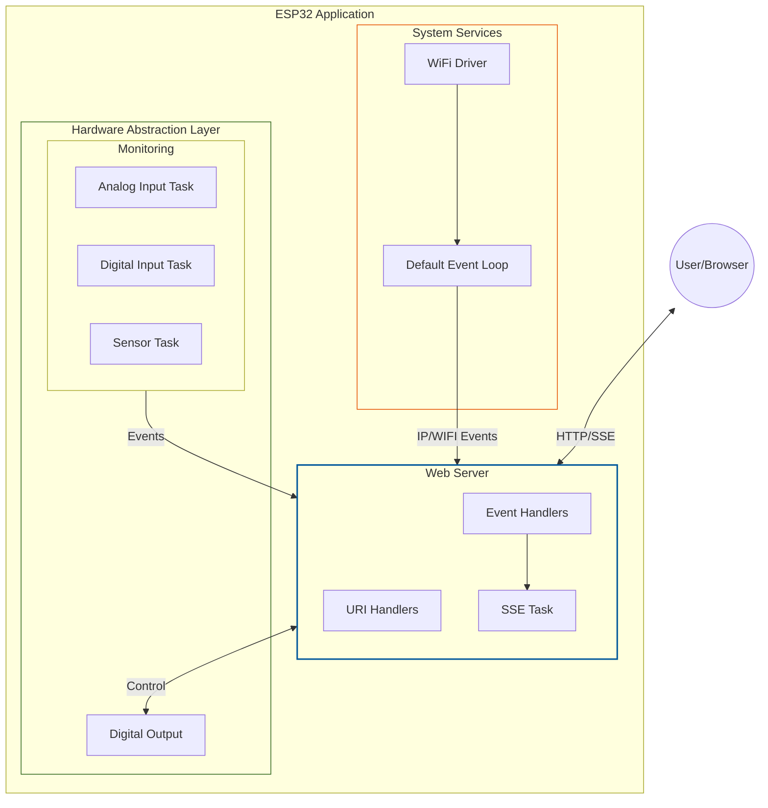

# FreeRTOS + ESP32: Embedded Systems Programming

This repository contains the source code for an academic extension project on embedded systems using FreeRTOS and ESP32.

The course covers multitasking, real-time scheduling, and inter-task communication. In the final project, you’ll build a dashboard hosted on the ESP32 to control and monitor it in real-time.

Part of [*The Parallel Computing School: Short Courses and Tutorials*](https://github.com/rogerioag/ecp-minicursos).

## Tech Stack

**Firmware:**  

**Frontend Dev:**  

## Architecture

The system is designed using an Event-Driven Architecture.

- **Real-Time Monitoring**: Instead of traditional HTTP polling, this project implements Server-Sent Events (SSE). This allows the ESP32 to push sensor updates to the frontend instantly as they happen, significantly reducing network traffic and latency.
- **Non-Blocking Hardware Abstraction**: Each hardware peripheral (Analog, Digital, Sensors) operates in its own dedicated FreeRTOS task. They communicate with the Web Server via asynchronous events, ensuring that a slow sensor read never freezes the UI or the WiFi stack.

## Frontend

The dashboard is built with [Web Components](https://developer.mozilla.org/en-US/docs/Web/API/Web_components) and [Webpack](https://webpack.js.org/) to bundle and minify the project, making it ideal for resource-limited devices like the ESP32.

### Desktop

### Mobile

For more details, see the [Frontend README](./components/web_server/frontend/README.md)
